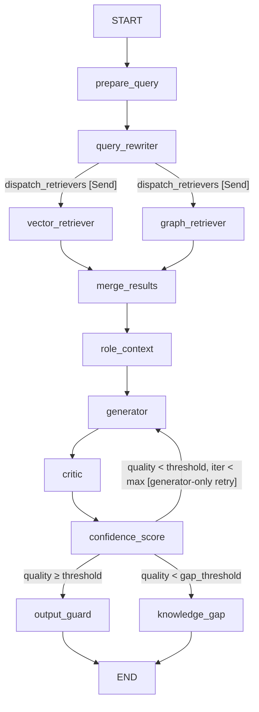
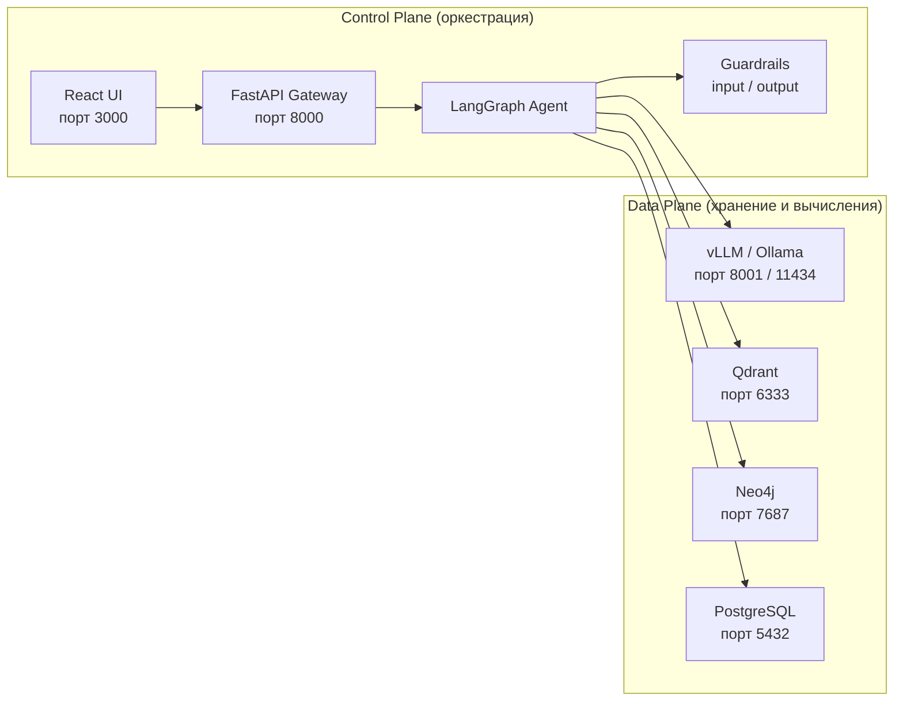
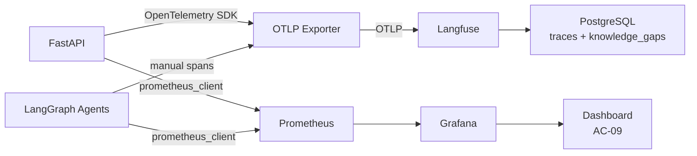

# Synapse — Architecture Design Document (ADD)

## Оглавление

1. [Overview](#1-overview)
2. [Technology Stack](#2-technology-stack)
3. [Multi-Agent Architecture](#3-multi-agent-architecture)
4. [Control Plane / Data Plane](#4-control-plane--data-plane)
5. [Security Model](#5-security-model)
6. [Document Preparation Pipeline](#6-document-preparation-pipeline)
7. [Observability](#7-observability)
8. [Deployment](#8-deployment)
9. [Capacity Planning](#9-capacity-planning)

---

## 1. Overview

### 1.1 Назначение

Synapse — корпоративная платформа интеллектуального анализа знаний на основе GraphRAG, работающая полностью в закрытом корпоративном контуре (on-premise / air-gapped). Система строит Knowledge Graph из внутренних документов и отвечает на вопросы сотрудников с учётом их ролевого доступа — без обращения к внешним API.

Ключевое архитектурное решение: вместо простого векторного поиска система комбинирует Qdrant (vector search) и Neo4j (graph traversal) через Reciprocal Rank Fusion (RRF) с весами `alpha=0.7` (вектор) и `0.3` (граф), получая контекстно-обогащённый результат. LLM получает контекст только после retrieval — генерация без поиска запрещена архитектурно.

### 1.2 Ключевые сценарии

**Q&A режим.** Сотрудник задаёт вопрос на русском языке через веб-интерфейс. LangGraph-агент выполняет гибридный поиск по корпусу документов с учётом роли пользователя (RBAC), генерирует ответ со ссылками на источники и оценкой актуальности (`confidence_score`). При низком качестве ответа агент выполняет Self-Reflection и повторно вызывает генератор с `critic_feedback` (generator-only retry, до 3 итераций). Вопросы без ответа фиксируются как Knowledge Gaps.

**Explorer режим.** Admin или Analyst исследует граф знаний через веб-интерфейс. Клик по узлу показывает связанные документы и отношения. Режим доступен только пользователям с `access_level = 5`.

### 1.3 Роли пользователей

| Роль | Access Level | Доступные документы |
|---|---:|---|
| Junior | 1 | Публичные регламенты, онбординг-материалы |
| Middle | 2 | + Технические стандарты, инженерные практики |
| Senior | 3 | + Архитектурные решения, ADR, системные документы |
| Manager | 4 | + HR-политики, процессы согласований |
| Admin / Analyst | 5 | Все документы + Explorer режим |

### 1.4 Архитектурные принципы

| Принцип | Описание |
|---|---|
| On-premise by default | Система разворачивается в закрытом контуре, без обращений к внешним API |
| Retrieval before generation | LLM получает контекст только после поиска — генерация без retrieval запрещена |
| Graph-enhanced context enrichment | Векторный поиск дополняется графовым траверсалом |
| Security enforced before inference | RBAC-фильтрация выполняется до передачи данных в LLM |
| Observability-first pipeline | Каждый этап трейсируется — от ingestion до генерации |
| Modular infrastructure | LLM, Vector DB, Graph DB заменяемы без переписывания логики |
| Separation of Control Plane and Data Plane | Оркестрация и хранилища разделены архитектурно |
| Ontology-driven knowledge graph | Одна сущность под разными именами создаёт один узел, не дубли |

### 1.5 MVP Scope Boundary

ADD описывает архитектуру MVP для дипломной защиты и демо, а не production-ready enterprise-платформу. В MVP входят:

- Q&A режим с гибридным поиском GraphRAG (RRF, `alpha=0.7` вектор, `0.3` граф);
- RBAC на уровне чанков Qdrant и узлов Neo4j;
- Input/Output Guardrails;
- Explorer режим для Admin;
- Document Preparation Pipeline для PDF, DOCX, XLSX, Markdown, CSV, сканов и опционального vision preprocessing при ingestion;
- Multi-Agent pipeline: `prepare_query`, `query_rewriter`, параллельный fan-out через `dispatch_retrievers` (LangGraph `Send()` API), `vector_retriever`, `graph_retriever`, `merge_results`, `role_context`, `generator`, `critic` (LLM-as-a-Judge), `confidence_score`, `output_guard` / `knowledge_gap`;
- Knowledge Gap Detection, Knowledge Confidence Score и Domain Ontology;
- Observability через OpenTelemetry, Langfuse, Prometheus и Grafana;
- локальный LLM runtime: local-lite — mock/optional Ollama, gpu-dev/demo — vLLM + Qwen2.5-14B-AWQ.

Вне MVP остаются JWT/LDAP/AD, Kubernetes/Helm, real-time синхронизация документов, cross-encoder reranker, MLOps pipeline, production-grade SLA/HA, коннекторы к Confluence/GitLab/ERP/CRM/HR-системам, автоматическая классификация `access_level`, промышленный OCR и полноценный Multimodal RAG как пользовательский retrieval/generation по изображениям, таблицам и схемам.

---

## 2. Technology Stack

| Компонент | Технология | Версия | ADR | Назначение |
|---|---|---|---|---|
| LLM (gpu-dev / demo / prod-like) | vLLM + Qwen2.5-14B-AWQ | 0.6.x | [ADR-001](./ADR/ADR-001-llm-serving.md) | Основной runtime полного MVP stack, GPU inference, KV-cache, OpenAI-compatible API |
| LLM (local-lite, optional) | Ollama + Qwen2.5-7B-Q4 или mock LLM | pinned in environment | [ADR-001](./ADR/ADR-001-llm-serving.md) | Fallback для Mac 8 GB: lightweight-тесты без полного stack |
| Embeddings | nomic-embed-text через embedding adapter; Ollama допустим как fallback | pinned in environment | [ADR-006](./ADR/ADR-006-embeddings.md) | Векторизация чанков, 768-dim, заменяемая реализация |
| Vector DB | Qdrant | 1.9 | [ADR-002](./ADR/ADR-002-vectordb.md) | Хранение эмбеддингов + retrieval-time RBAC filter |
| Graph DB | Neo4j Community | 5.18 | [ADR-003](./ADR/ADR-003-graphdb.md) | Knowledge Graph, Cypher traversal, Explorer визуализация |
| Orchestration | LangGraph | 0.2+ | [ADR-004](./ADR/ADR-004-orchestration.md), [ADR-012](./ADR/ADR-012-multi-agent.md) | Multi-agent orchestration, parallel retrieval, retry cycles |
| Access Control | Chunk-level RBAC | — | [ADR-005](./ADR/ADR-005-rbac.md) | Числовой access_level на каждом чанке и узле графа |
| API | FastAPI + uvicorn | — | — | REST, OpenAPI автогенерация; стриминг SSE — Scale |
| Frontend | Vanilla HTML + JS + Tailwind CSS | — | [ADR-011](./ADR/ADR-011-frontend.md) | Q&A UI + Explorer (таблица узлов/рёбер); статика раздаётся FastAPI StaticFiles |
| Tracing | OpenTelemetry SDK + Langfuse | — | [ADR-010](./ADR/ADR-010-observability.md) | OTel spans по FastAPI и LangGraph, экспорт OTLP в Langfuse |
| Metrics | Prometheus + Grafana | — | [ADR-010](./ADR/ADR-010-observability.md) | RPS, latency, tokens/sec, error rate |
| Storage | PostgreSQL | 16 | — | Langfuse traces; `knowledge_gaps` и `audit_log` — SQLite (WAL) в MVP, PostgreSQL — Scale |
| Infra | Docker Compose | — | — | Единая команда запуска, пинированные версии |
| GPU Dev | VM 64 GB RAM + NVIDIA RTX 4090 24 GB VRAM | — | — | Основная среда разработки полного stack и предварительных нагрузочных тестов |
| Cloud / Demo / Prod-like | Yandex Cloud T4 16GB или другой GPU-сервер | — | — | Production-like демо; финальный sizing подтверждается нагрузочным тестом |

Переключение между local-lite, gpu-dev и demo/prod-like LLM-бэкендом выполняется через env var:

```bash
LLM_BACKEND=mock     # local-lite — тесты без LLM
LLM_BACKEND=ollama   # local-lite fallback — Ollama + Qwen2.5-7B-Q4
LLM_BACKEND=vllm     # gpu-dev / demo / prod-like — vLLM + Qwen2.5-14B-AWQ
```

Единый LLM client в `/backend/llm/client.py` абстрагирует оба бэкенда — код агента не зависит от выбора inference-сервера.

---

## 3. Multi-Agent Architecture

### 3.1 Топология агентов

Synapse реализует multi-agent pipeline на LangGraph `StateGraph`. Детальное решение зафиксировано в [ADR-012](./ADR/ADR-012-multi-agent.md). В MVP агенты являются логическими компонентами backend-приложения и не требуют отдельных инфраструктурных узлов.

| Нода / Компонент | Тип | Назначение |
|---|---|---|
| `QueryRequest` (FastAPI) | HTTP layer | Валидация до вызова агента: prompt injection → HTTP 422; PII → маскирование (`api/schemas.py`) |
| `prepare_query` | Нода | Preprocessing: strip, нормализация, извлечение сущностей из онтологии |
| `query_rewriter` | Нода | LLM-переформулировка вопроса в документо-ориентированный стиль (улучшение recall) |
| `dispatch_retrievers` | Conditional edge | Fan-out: запускает `vector_retriever` и `graph_retriever` параллельно через LangGraph `Send()` |
| `vector_retriever` | Нода | Семантический поиск в Qdrant с RBAC payload filter (использует `query_rewritten`) |
| `graph_retriever` | Нода | Graph traversal в Neo4j с RBAC `WHERE access_level <= user_level` (использует `entities`) |
| `merge_results` | Нода | Hybrid merge: RRF (`alpha=0.7` вектор, `0.3` граф, `k=60`) |
| `role_context` | Нода | Детерминированная ролевая подсказка для генератора по `access_level` (L1–L5) |
| `generator` | Нода | Генерация ответа через vLLM на основе разрешённого контекста + `role_hint`; на retry принимает `critic_feedback` |
| `critic` | Нода | Независимая оценка ответа (LLM-as-a-Judge, few-shot); выдаёт `quality_score` и `critic_feedback` |
| `confidence_score` | Нода | Вычисление актуальности источников по `last_updated` |
| `should_retry` | Conditional edge | Маршрутизация: generator-only retry / `output_guard` / `knowledge_gap` |
| `output_guard` | Нода | PII маскирование ответа (FR-27) |
| `knowledge_gap` | Нода | Фиксация неотвеченного запроса в SQLite (`knowledge_gaps` таблица) |

### 3.2 Граф выполнения



Безопасность на входе обеспечивается на уровне FastAPI (`QueryRequest.strip_and_guard_query` в `api/schemas.py`), до вызова агента.

Conditional edge `should_retry` (от `confidence_score`):

```python
def should_retry(self, state: AgentState) -> str | list[Send]:
    if quality < retry_threshold and iterations < max_iterations:
        # Generator-only retry: retrieval пропускается, critic_feedback передаётся генератору
        return [Send("generator", state)]
    if quality < gap_threshold:
        return "knowledge_gap"
    return "output_guard"
```

Максимум итераций retry задаётся через `AGENT_MAX_ITERATIONS` — защита от бесконечного цикла.

### 3.3 AgentState

```python
class AgentState(TypedDict):
    query: str                     # исходный запрос пользователя
    access_level: int              # уровень доступа из X-User-Role заголовка
    entities: list[str]            # онтологически разрешённые сущности из запроса
    query_rewritten: str           # переформулированный поисковый запрос (query_rewriter)
    vector_chunks: list[RetrievedChunk]   # результаты Qdrant (ранее vector_results)
    graph_results: list[GraphResult]      # результаты Neo4j traversal
    sources: list[MergedSource]    # merged + ranked результаты из merge_results
    role_hint: str                 # ролевая подсказка из role_context (детерминированная)
    answer: str                    # сгенерированный ответ
    quality_score: float           # оценка CriticAgent (1.0–4.0)
    critic_feedback: str           # объяснение оценки; передаётся генератору при retry
    confidence_score: float        # актуальность источников по last_updated (0–1)
    iterations: int                # счётчик вызовов critic (защита от бесконечного retry)
    gap_detected: bool             # флаг для knowledge_gap ноды
    trace_id: str                  # идентификатор трейса (из LLM-ответа)
```

### 3.4 CriticAgent (LLM-as-a-Judge)

`critic` нода выполняет отдельный LLM-вызов после генерации ответа. Она получает вопрос, ответ и источники, возвращает оценку в формате `ЧИСЛО | ПОЯСНЕНИЕ` (`quality_score` + `critic_feedback`). При низком `quality_score` и числе итераций меньше максимума `should_retry` выполняет **generator-only retry** через `Send("generator", state)` — retrieval пропускается, `critic_feedback` передаётся генератору как `retry_feedback` для адресного улучшения ответа. При `quality_score < gap_threshold` запрос фиксируется как Knowledge Gap (независимо от числа итераций, если retry-порог не срабатывает).

Такой подход устраняет self-assessment bias: генератор не оценивает собственный ответ, а качество проверяет отдельный агент.

---

## 4. Control Plane / Data Plane

Система архитектурно разделена на два слоя. Control Plane содержит логику оркестрации и не хранит бизнес-данные. Data Plane содержит хранилища и inference — без логики маршрутизации.



**Принцип замены:** компоненты Data Plane заменяемы при сохранении контрактов адаптеров. Например, замена vLLM на SGLang или Qdrant на Milvus не должна менять бизнес-логику LangGraph-агента, но потребует реализации соответствующего клиента/адаптера в `/backend/llm/client.py` или retrieval-слое.

| Слой | Компоненты | Характеристика |
|---|---|---|
| Control Plane | React UI, FastAPI, LangGraph, Guardrails | Не хранит бизнес-данные, содержит логику |
| Data Plane | vLLM/Ollama, Qdrant, Neo4j, PostgreSQL | Хранит данные, не содержит routing-логики |

---

## 5. Security Model

### 5.1 Три слоя RBAC

RBAC реализован как три последовательных слоя фильтрации. Данные, недоступные пользователю, не попадают в LLM — не только не отображаются в ответе, но физически не извлекаются из хранилищ.

```
Запрос
  → [Слой 1: API Gateway] — проверка X-User-Role заголовка
  → [Слой 2: Qdrant filter] — retrieval только чанков с access_level ≤ user_level
  → [Слой 3: Neo4j WHERE] — traversal только узлов с access_level ≤ user_level
  → LLM (видит только разрешённый контекст)
```

**Слой 1 — API Gateway** (`/backend/security/rbac.py`):

```python
def role_to_access_level(role: str | None) -> int:
    """Возвращает числовой access_level из X-User-Role заголовка.
    Неизвестная роль → access_level=1 (минимальный, fail-closed).
    """
    return ROLES.get(role or "", 1)
```

**Слой 2 — Qdrant** (`/backend/retrieval/vector_retriever.py`):

```python
query_filter = Filter(must=[
    FieldCondition(key="access_level", range=Range(lte=user_level))
])
```

**Слой 3 — Neo4j** (Cypher в `/backend/retrieval/graph_retriever.py`):

```cypher
MATCH (d:Document)-[:HAS_SECTION]->(s:Section)
WHERE d.access_level <= $user_level
AND s.access_level <= $user_level
RETURN d, s LIMIT 10
```

Единый источник истины — числовой `access_level` (int 1–5), одновременно применяемый в обоих хранилищах. Подробное обоснование выбора — в [ADR-005](./ADR/ADR-005-rbac.md).

### 5.2 Guardrails

| Тип | Что проверяется | Реализация |
|---|---|---|
| Input Guard | PII: email, телефон, паспортные данные | regex (`security/pii.py`) |
| Input Guard | Prompt injection: паттерны типа `ignore previous instructions` | regex (`security/injection.py`) |
| Input Guard | Длина запроса: макс. 1000 символов | FastAPI Pydantic validator |
| Output Guard | PII в сгенерированном ответе | regex (`output_guard` нода) |

> NER и keyword-фильтр нежелательного контента не реализованы в MVP (Scale-этап).

### 5.3 Zero External APIs

Runtime-контур inference/retrieval не выполняет запросов к внешним LLM/API. Запрещены обращения к OpenAI, Anthropic, Yandex GPT и любым внешним сервисам с пользовательскими или корпоративными данными. Проверяется через network logs (NFR-03). Загрузка зависимостей и моделей относится к подготовке окружения, а не к runtime processing path.

### 5.4 Audit Log

Каждый запрос фиксируется в SQLite (WAL-режим, `backend/db/audit_store.py`, таблица `audit_log`). PostgreSQL как хранилище audit_log — Scale-этап.

| Поле | Тип | Описание |
|---|---|---|
| `user_role` | varchar | Роль из X-User-Role |
| `access_level` | int | Числовой уровень доступа |
| `query_hash` | varchar | SHA-256 текста запроса (не plain text) |
| `result_count` | int | Количество найденных чанков |
| `quality_score` | float | Финальная оценка ответа |
| `gap_detected` | bool | Был ли запрос зафиксирован как Knowledge Gap |
| `timestamp` | timestamptz | Время запроса |

---

## 6. Document Preparation Pipeline

Реальные корпоративные документы поступают в неструктурированном виде: текстовые PDF, сканы, DOCX/XLSX, Markdown/CSV, схемы и чертежи. Document Preparation Pipeline — обязательный слой подготовки перед индексацией, выполняется однократно при загрузке. Решение зафиксировано в [ADR-013](./ADR/ADR-013-multimodal.md).

```
Сырой документ (PDF / DOCX / XLSX / Markdown / CSV / скан / чертёж)
        ↓
[1. Парсинг и очистка]         ← pymupdf
        ↓
[2. OCR для сканов]            ← easyocr (ru+en, 300 DPI)
        ↓
[3. Vision-описание]           ← Qwen2.5-VL при VISION_ENABLED=true
        ↓
[4. Структурирование по разделам]
        ↓
[5. Нормализация терминов (ontology.json)]
        ↓
[6. Разметка метаданных оператором]
        ↓
[7. Валидация]
        ↓
Подготовленный документ → Ingestion Pipeline
```

### 6.1 Этапы

**Парсинг** (`/backend/ingestion/parsers/`). Форматы и инструменты:

| Формат | Библиотека | Что извлекается / очищается |
|---|---|---|
| PDF | pymupdf | Нативный текст, структура блоков, колонтитулы, водяные знаки, служебные символы |
| Сканированный PDF | pymupdf + easyocr | Растеризация страниц 300 DPI, OCR ru+en |
| Страница с чертежом / схемой | Qwen2.5-VL при `VISION_ENABLED=true` | Текстовое описание изображения, если после OCR < 50 токенов |
| DOCX | python-docx | Стили, ревизии, скрытый текст |
| XLSX | openpyxl | Пустые строки, формулы (только значения) |
| Markdown | прямой текст | HTML-комментарии, front matter |
| CSV | pandas | Пустые строки, BOM |

**Структурирование.** Документ разбивается по заголовкам (H1/H2). Каждый раздел становится отдельным узлом `(:Section {title, content_summary, access_level, doc_id})` в Neo4j.

**Нормализация.** Entity extractor выполняет fuzzy match извлечённой сущности по `ontology.json` (порог схожести 0.85). При совпадении используется `canonical_name` — новый узел не создаётся. Пример:

```json
{
  "canonical": "GitLab",
  "type": "System",
  "aliases": ["gitlab", "наш gitlab", "система контроля версий"]
}
```

**Разметка метаданных.** Оператор указывает при вызове `POST /ingest`:

```json
{
  "access_level": 3,
  "doc_type": "standard",
  "doc_id": "arch-001",
  "last_updated": "2025-11-01"
}
```

**Валидация.** Документ отклоняется (HTTP 422) если:
- текст пустой после очистки
- `access_level` не указан
- объём менее 100 токенов

Результат подготовки логируется: количество извлечённых разделов, итоговый объём токенов, источник извлечения (`native` / `ocr` / `vision`) и статус валидации.

> **Scale-этап:** OCR промышленного качества, автоматическая классификация `access_level` через LLM, обработка таблиц как структурированных данных, коннекторы к Confluence и GitLab.

---

## 7. Observability

### 7.1 Архитектура observability



### 7.2 Трейсинг (OpenTelemetry → Langfuse)

OpenTelemetry SDK является стандартом инструментирования. FastAPI инструментируется автоматически, а каждая нода LangGraph создаёт отдельный manual span. Экспорт выполняется по OTLP в Langfuse:

```bash
LANGFUSE_OTLP_ENDPOINT=http://langfuse:3000/api/public/otel/v1/traces
```

Каждый span содержит:

- технические атрибуты: latency, status, error;
- безопасные атрибуты запроса: `role`, `access_level`, длина запроса;
- retrieval-атрибуты: число найденных чанков, latency Qdrant/Neo4j;
- LLM-атрибуты: tokens/sec, model backend, `quality_score`, `confidence_score`.

Трейс одного запроса охватывает все ноды от `input_guard` до `output_guard` / `knowledge_gap`. Это позволяет визуально найти bottleneck: какая нода занимает наибольшую долю E2E latency.

### 7.3 Метрики (Prometheus)

| Метрика | Тип | Описание |
|---|---|---|
| `request_latency_seconds` | Histogram | E2E latency запроса, labels: role, status |
| `request_count_total` | Counter | Число запросов, labels: role, status |
| `tokens_per_second` | Gauge | Скорость генерации LLM |
| `knowledge_gap_total` | Counter | Число неотвеченных запросов за период |
| `retrieval_latency_seconds` | Histogram | Latency hybrid retrieval (Qdrant + Neo4j) |

### 7.4 Grafana Dashboard

Панели дашборда (для демо и AC-09):

- E2E Latency P50 / P95 (цель: P95 < 10 сек на GPU)
- Retrieval Latency P95 (цель: < 300 мс)
- RPS и Error Rate
- Tokens/sec (vLLM)
- Knowledge Gaps за 24ч
- VRAM usage (nvidia-smi exporter)

### 7.5 Knowledge Gaps

Неотвеченные запросы (`quality_score < gap_threshold` после max iterations) фиксируются в SQLite (`backend/db/gap_store.py`, WAL-режим):

```sql
CREATE TABLE knowledge_gaps (
    id            INTEGER PRIMARY KEY AUTOINCREMENT,
    query         TEXT    NOT NULL,   -- текст запроса (намеренно: нужен для анализа пробелов)
    access_level  INTEGER NOT NULL,   -- уровень доступа пользователя
    quality_score REAL    NOT NULL,
    iterations    INTEGER NOT NULL DEFAULT 0,
    timestamp     TEXT    NOT NULL
);
```

В `audit_log` текст запроса хэшируется (SHA-256), чтобы не хранить лишние пользовательские данные. В `knowledge_gaps` текст вопроса сохраняется намеренно: он нужен Admin/Analyst для пополнения корпуса знаний и анализа пробелов. PostgreSQL как хранилище knowledge_gaps — Scale-этап.

Эндпоинт `GET /knowledge-gaps` доступен только Admin (`access_level = 5`). Ответ пользователю при gap: «Информация по данному вопросу отсутствует в корпусе. Запрос зафиксирован для пополнения базы знаний».

---

## 8. Deployment

### 8.1 Запуск

```bash
# Local-lite stack: API/UI/DB без обязательного LLM или с mock/Ollama fallback
docker compose up -d

# GPU profile для gpu-dev / MVP demo
docker compose --profile gpu up -d

# Observability profile: Langfuse, Prometheus, Grafana
docker compose --profile observability up -d

# Только ingestion pipeline (Document Preparation + индексация)
docker compose --profile ingest up

# Проверка состояния
docker compose ps
curl http://localhost:8000/health
```

### 8.2 Сервисы и порты

| Сервис | Порт | Profile | Health Check |
|---|---:|---|---|
| React UI (nginx) | 3000 | default | `GET /` |
| FastAPI | 8000 | default | `GET /health` |
| vLLM (gpu-dev / demo) | 8001 | gpu | `GET /health` |
| Ollama (local-lite fallback) | 11434 | optional | `GET /api/tags` |
| Qdrant | 6333 / 6334 | default | `GET /healthz` |
| Neo4j Browser | 7474 | default | `GET /` |
| Neo4j Bolt | 7687 | default | bolt protocol |
| Langfuse | 3001 | observability | `GET /api/public/health` |
| Prometheus | 9090 | observability | `GET /-/healthy` |
| Grafana | 3002 | observability | `GET /api/health` |
| PostgreSQL | 5432 | default / observability | pg_isready |
| Vision LLM | 8002 | ingest | `GET /health` |

### 8.3 Порядок запуска (depends_on)

```
PostgreSQL
  → Qdrant, Neo4j (параллельно)
    → Ollama или vLLM
      → FastAPI
        → React UI

Observability profile:
PostgreSQL → Langfuse
Prometheus → Grafana
```

### 8.4 Переключение local-lite / gpu-dev / demo

```bash
# local-lite — без полноценного LLM stack
LLM_BACKEND=mock docker compose up -d

# local-lite fallback — Ollama на Mac / Apple Silicon
LLM_BACKEND=ollama docker compose up -d

# gpu-dev / demo — vLLM на GPU-сервере
LLM_BACKEND=vllm docker compose --profile gpu up -d
```

### 8.5 Profile `ingest`

OCR через easyocr входит в MVP и выполняется на этапе ingestion. Vision-модель Qwen2.5-VL запускается только в профиле `ingest` при `VISION_ENABLED=true`, чтобы не конкурировать с основной LLM за VRAM во время inference.

### 8.6 Volumes и конфигурация

Все Docker volumes явно именованы в `docker-compose.yml`. Управление секретами — через `.env` файл (Vault рекомендован для Scale-этапа). Образы пинированы по версиям (не `latest`) для воспроизводимости (NFR-08).

---

## 9. Capacity Planning

Детальный расчёт ресурсов для local-lite, GPU Dev и demo/prod-like профилей, retention policy, backup strategy и план валидации — в [`/docs/capacity_planning.md`](./capacity_planning.md).

Ключевые цифры:

| Ресурс | Local Lite (Mac 8 GB) | GPU Dev (64 GB RAM + RTX 4090) | MVP Demo / Prod-like |
|---|---:|---:|---:|
| RAM | 8 GB, без полного stack | ~20–30 GB из 64 GB | ~19–22 GB из 96 GB |
| VRAM | нет CUDA GPU | ~12–16 GB из 24 GB RTX 4090 | ~12–15.5 GB из 16 GB T4 |
| CPU | lightweight-тесты | 8+ cores | 8+ cores |
| Disk | 50–100 GB | 150–250+ GB | 150–250+ GB |
| API RPS (целевой MVP) | не измеряется | предварительные тесты до 10 RPS | до 10 RPS |

Основная разработка полного стека выполняется на GPU Dev VM. Mac 8 GB используется как local-lite среда и не является целевым окружением для запуска LLM, observability и всех БД одновременно. Основной ограниченный ресурс demo/prod-like среды — VRAM.

Финальные значения RPS подтверждаются нагрузочным тестированием (AC-09). До его выполнения все RPS-оценки являются предварительными sizing-гипотезами. Результаты фиксируются в `/docs/load_test_report.md`.
