# C4 Level 4 — Code Diagram: Q&A LangGraph Pipeline

**Scope:** code-level view for `API Gateway` and `LangGraph Orchestrator` in the Q&A path.

This diagram refines the C4 Level 3 `LangGraph Orchestrator` component from `workspace.dsl` down to the concrete Python modules, functions, dataclasses and runtime adapters used by `POST /query`.

```mermaid
classDiagram
    direction LR

    class QueryRequest {
        <<PydanticModel>>
        +str query
        +bool stream
        +strip_and_guard_query()
    }

    class QueryResponse {
        <<PydanticModel>>
        +str answer
        +list sources
        +float quality_score
        +float confidence_score
        +bool gap_detected
        +str trace_id
        +str critic_feedback
    }

    class routes_query {
        <<FastAPIHandler>>
        +query(payload, X_User_Role, settings) QueryResponse
    }

    class role_to_access_level {
        <<RBACFunction>>
        +role_to_access_level(role) int
    }

    class mask_pii {
        <<GuardrailFunction>>
        +mask_pii(text) str
    }

    class QueryService {
        <<DomainService>>
        +ask(query, access_level) QueryResult
    }

    class run_agent {
        <<ApplicationService internal>>
        +run_agent(query, access_level, settings) QueryResult
    }

    class build_graph {
        <<LangGraphFactory>>
        +build_graph(settings) CompiledGraph
    }

    class AgentState {
        <<TypedDict>>
        +str query
        +int access_level
        +list entities
        +str query_rewritten
        +list vector_chunks
        +list graph_results
        +list sources
        +str role_hint
        +str answer
        +float quality_score
        +str critic_feedback
        +float confidence_score
        +int iterations
        +bool gap_detected
        +str trace_id
    }

    class node_prepare_query {
        <<LangGraphNode>>
        +strip query
        +extract_entities(query)
    }

    class node_query_rewriter {
        <<LangGraphNode>>
        +get_query_rewriter()
        +rewrite(query) str
    }

    class dispatch_retrievers {
        <<LangGraphRouter>>
        +Send(vector_retriever, state)
        +Send(graph_retriever, state)
    }

    class node_vector_retriever {
        <<LangGraphNode>>
        +get_vector_retriever()
        +search(query, access_level)
    }

    class node_graph_retriever {
        <<LangGraphNode>>
        +get_graph_retriever()
        +search(entities, access_level)
    }

    class node_merge_results {
        <<LangGraphNode>>
        +_merge(vector_chunks, graph_results, alpha)
    }

    class node_role_context {
        <<LangGraphNode>>
        +_ROLE_HINTS dict
        +role_context(state) dict
    }

    class node_generator {
        <<LangGraphNode async>>
        +get_llm_client()
        +generate_answer(query, access_level, context)
    }

    class node_critic {
        <<LangGraphNode>>
        +get_critic()
        +evaluate(query, answer, sources)
    }

    class node_confidence_score {
        <<LangGraphNode>>
        +_compute_confidence(sources) float
    }

    class should_retry {
        <<LangGraphRouter>>
        +should_retry(state) str or list~Send~
    }

    class node_output_guard {
        <<LangGraphNode>>
        +mask_pii(answer)
    }

    class node_knowledge_gap {
        <<LangGraphNode>>
        +record_gap(query, access_level, quality_score, iterations)
    }

    class RetrievedChunk {
        <<dataclass>>
        +str doc_id
        +str section_title
        +str text
        +int access_level
        +str last_updated
        +float score
    }

    class GraphResult {
        <<dataclass>>
        +str doc_id
        +str section_title
        +str summary
        +int access_level
        +int match_count
        +int hop_distance
    }

    class MergedSource {
        <<dataclass>>
        +str doc_id
        +str section_title
        +str text
        +int access_level
        +str last_updated
        +float score
    }

    class QueryResult {
        <<dataclass>>
        +str answer
        +list sources
        +float quality_score
        +float confidence_score
        +bool gap_detected
        +str trace_id
        +str critic_feedback
    }

    class QdrantVectorRetriever {
        <<Adapter>>
        +search(query, user_access_level, limit) list~RetrievedChunk~
        +build_qdrant_rbac_filter(user_access_level)
    }

    class Neo4jGraphRetriever {
        <<Adapter>>
        +search(entity_names, user_access_level, depth) list~GraphResult~
    }

    class LLMClient {
        <<Protocol async>>
        +generate_answer(query, access_level, context)
    }

    class CriticAgent {
        <<Protocol>>
        +evaluate(query, answer, sources) CriticResult
    }

    class gap_store {
        <<Persistence SQLite WAL>>
        +record_gap(query, access_level, quality_score, iterations)
    }

    class Qdrant {
        <<DataPlane>>
        +rbac_payload_filter
        +vector_search
    }

    class Neo4j {
        <<DataPlane>>
        +rbac_where_clause COALESCE
        +graph_traversal
    }

    class vLLM_or_MockLLM {
        <<DataPlane>>
        +local_inference_adapter
    }

    class Langfuse {
        <<Observability>>
        +langgraph_callbacks
    }

    routes_query --> QueryRequest : validates request (HTTP first-line)
    routes_query --> role_to_access_level : X-User-Role
    QueryRequest --> mask_pii : FR-25 PII mask + FR-26 injection (Pydantic)
    routes_query --> QueryService : delegates to domain layer
    QueryService --> mask_pii : FR-25 PII mask (domain gate)
    QueryService --> run_agent : after injection + PII guard
    run_agent --> AgentState : creates initial state
    run_agent --> build_graph : cached compiled graph
    run_agent --> QueryResult : returns domain result
    routes_query --> QueryResponse : maps API response

    build_graph --> node_prepare_query : START → prepare_query
    node_prepare_query --> node_query_rewriter : entities extracted
    node_query_rewriter --> dispatch_retrievers : query_rewritten set, fan-out
    dispatch_retrievers --> node_vector_retriever : Send() uses query_rewritten
    dispatch_retrievers --> node_graph_retriever : Send() uses entities
    node_vector_retriever --> QdrantVectorRetriever : adapter
    node_graph_retriever --> Neo4jGraphRetriever : adapter
    QdrantVectorRetriever --> Qdrant : access_level ≤ user
    Neo4jGraphRetriever --> Neo4j : COALESCE(access_level,1) ≤ user
    QdrantVectorRetriever --> RetrievedChunk : returns
    Neo4jGraphRetriever --> GraphResult : returns (with match_count, hop_distance)
    node_vector_retriever --> node_merge_results : vector_chunks
    node_graph_retriever --> node_merge_results : graph_results
    node_merge_results --> MergedSource : RRF fusion (alpha×vector + graph_signal)
    node_merge_results --> node_role_context : sources
    node_role_context --> node_generator : role_hint + sources
    node_generator --> LLMClient : generate answer async (+ retry_feedback on retry)
    LLMClient --> vLLM_or_MockLLM : backend
    node_generator --> node_critic : answer + trace_id
    node_critic --> CriticAgent : quality_score + feedback → critic_feedback
    node_critic --> node_confidence_score : quality_score
    node_confidence_score --> should_retry : confidence_score computed
    should_retry --> node_generator : generator-only retry (quality < threshold, iter < max)
    should_retry --> node_knowledge_gap : quality < 2.0 after max retries
    should_retry --> node_output_guard : quality ≥ 2.0 (after max iter) or ≥ 3.0
    node_knowledge_gap --> gap_store : persist gap (SQLite WAL)
    node_output_guard --> mask_pii : masks output PII (FR-27)
    node_output_guard --> QueryResult : final answer
    build_graph --> Langfuse : callbacks from run_agent
```

## Code Mapping

| Diagram element | Source file | Responsibility |
|---|---|---|
| `routes_query`, `QueryRequest`, `QueryResponse` | `backend/api/routes.py`, `backend/api/schemas.py` | API contract, input validation, `X-User-Role` handling |
| `QueryService` | `backend/query/service.py` | Domain-layer security gate: injection check (FR-26) + PII mask (FR-25) before `run_agent()`. Authoritative entry point for all callers (HTTP, scripts, tests). |
| `role_to_access_level` | `backend/security/rbac.py` | Role to numeric `access_level` mapping, HTTP 403 for unknown roles |
| `mask_pii` | `backend/security/pii.py` | Input PII masking (FR-25) and output PII masking (FR-27) |
| `run_agent`, `build_graph`, `AgentState` | `backend/agents/graph_agent.py` | Compiled graph cache, async ainvoke, QueryResult assembly |
| `node_prepare_query` | `backend/agents/nodes.py :: AgentNodes.prepare_query` | Query preprocessing: strip + entity extraction (FR-41a). NOT a security gate. |
| `node_query_rewriter` | `backend/agents/nodes.py :: AgentNodes.query_rewriter` | LLM-based query rewriting: question → document-style terms for better vector recall. Uses `query_rewritten` state field. |
| `node_role_context` | `backend/agents/nodes.py :: AgentNodes.role_context` | Deterministic role-aware focus hint: access_level → `role_hint` string. No LLM call, O(1). |
| `dispatch_retrievers`, `should_retry` | `backend/agents/nodes.py :: AgentNodes` | Fan-out routing and retry/gap/output_guard decision (FR-48a). Retry is generator-only (no re-retrieval). |
| `node_vector_retriever`, `node_graph_retriever`, … | `backend/agents/nodes.py :: AgentNodes` | Thin LangGraph wrappers delegating to retriever adapters |
| `QdrantVectorRetriever`, `RetrievedChunk` | `backend/retrieval/vector_retriever.py` | Vector search with Qdrant RBAC payload filter |
| `Neo4jGraphRetriever`, `GraphResult` | `backend/retrieval/graph_retriever.py` | Graph traversal; returns `match_count` and `hop_distance` for RRF scoring |
| `_merge`, `_compute_confidence`, `MergedSource`, `QueryResult` | `backend/query/pipeline.py` | RRF hybrid fusion (`alpha/(k+rank_v)` + `graph_signal/(k+rank_g)`), staleness confidence score |
| `CriticAgent`, `VLLMCriticAgent`, `MockCriticAgent` | `backend/query/critic.py` | Answer quality scoring; vLLM in gpu-demo, mock in local-lite |
| `LLMClient`, `VLLMClient`, `MockLLMClient` | `backend/llm/client.py` | Async generation adapter; accepts `retry_feedback` on retry iterations |
| `gap_store` | `backend/db/gap_store.py` | Knowledge Gap persistence — SQLite WAL in all modes; spec target PostgreSQL not yet implemented |

## Requirements Coverage

| Requirement | Covered by |
|---|---|
| FR-01, FR-03 | `routes_query`, `QueryResponse`, `run_agent` |
| FR-02a, FR-22a, FR-46a | `node_vector_retriever`, `QdrantVectorRetriever`, `build_qdrant_rbac_filter` |
| FR-02b, FR-22b, FR-46b | `node_graph_retriever`, `Neo4jGraphRetriever` |
| FR-02c | `node_merge_results`, `_merge` |
| FR-04, FR-21, FR-23 | `role_to_access_level`, retriever RBAC adapters |
| FR-25a/b/c, FR-26, FR-27 | `QueryRequest.strip_and_guard_query`, `mask_pii`, `node_output_guard` |
| FR-31, FR-32a/b, FR-34 | `node_knowledge_gap`, `gap_store` (SQLite) |
| FR-35, FR-36a/b, FR-37, FR-38 | `node_confidence_score`, `_compute_confidence`, `QueryResponse` |
| FR-41a | `node_prepare_query`, `extract_entities` |
| FR-45, FR-48a/b | `dispatch_retrievers`, `should_retry`, LangGraph `Send()` |
| FR-47a/b | `node_critic`, `CriticAgent`, `VLLMCriticAgent` |
