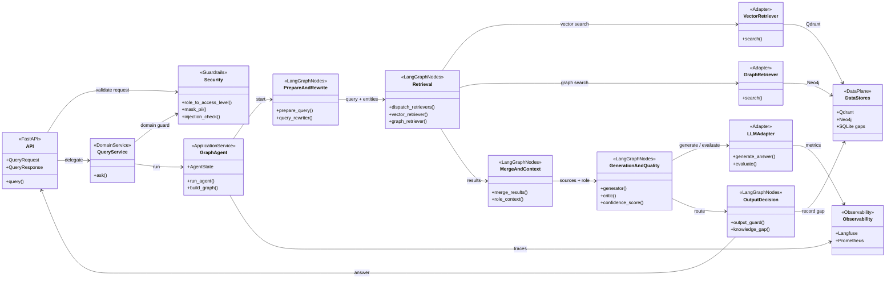

# C4 Level 4 — Code Diagram: Q&A LangGraph Pipeline

**Scope:** code-level view for `POST /query`.

Shows API validation, domain gate, LangGraph pipeline, retrievers, LLM adapters and persistence.

## Code Mapping

| Area | Source files | Responsibility |
|---|---|---|
| API | `backend/api/routes.py`, `backend/api/schemas.py` | HTTP contract and request validation |
| Security | `backend/security/*` | RBAC, PII masking, injection guard |
| Domain gate | `backend/query/service.py` | Safe entry point before LangGraph |
| Graph topology | `backend/agents/graph_agent.py`, `backend/agents/state.py` | graph build, state, agent execution |
| LangGraph nodes | `backend/agents/nodes.py` | поиск, генерация, маршрутизация качества |
| Query utilities | `backend/query/pipeline.py`, `backend/query/critic.py` | merge, confidence, critic adapters |
| Retrieval adapters | `backend/retrieval/vector_retriever.py`, `backend/retrieval/graph_retriever.py` | Qdrant and Neo4j access |
| LLM adapter | `backend/llm/client.py` | answer generation |
| Persistence | `backend/db/gap_store.py` | knowledge gaps |

## Requirements Coverage

| Requirement group | Covered by |
|---|---|
| Q&A API and response | API, QueryService, GraphAgent |
| Hybrid retrieval | Retrieval, VectorRetriever, GraphRetriever, MergeAndContext |
| RBAC and guardrails | Security, retriever filters, OutputDecision |
| Quality control and retries | GenerationAndQuality, OutputDecision |
| Knowledge gaps | OutputDecision, Persistence |
| Observability | Observability, GraphAgent, LLMAdapter |
