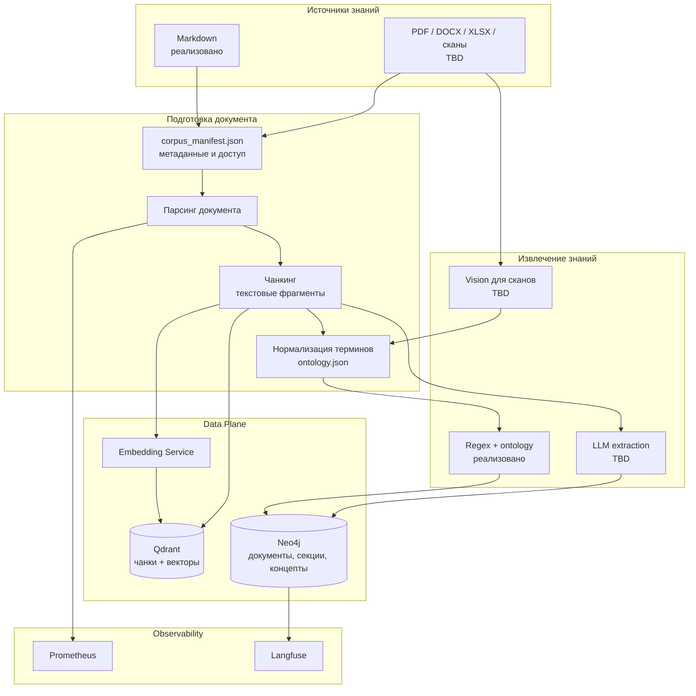

## Статус реализации

| Компонент | Статус | Файл |
|---|---|---|
| Markdown corpus | реализовано | `backend/ingestion/corpus_loader.py` |
| Чанкинг | реализовано | `backend/ingestion/chunker.py` |
| Embeddings batch | реализовано | `backend/embeddings/client.py` |
| Запись в Qdrant | реализовано | `backend/ingestion/storage.py` |
| Запись в Neo4j | реализовано | `backend/ingestion/storage.py` |
| Regex + ontology extraction | реализовано | `backend/query/pipeline.py` |
| PDF / DOCX / XLSX / OCR / Vision | TBD | ADR-013 |
