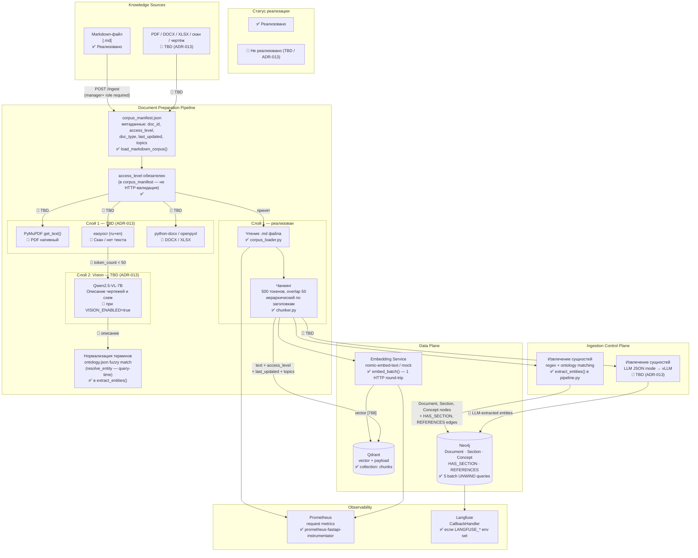

## Статус реализации

| Компонент | Статус | Файл |
|---|---|---|
| Чтение .md корпуса | ✅ реализовано | `backend/ingestion/corpus_loader.py` |
| Чанкинг (500 токенов, overlap 50) | ✅ реализовано | `backend/ingestion/chunker.py` |
| Batch embeddings (1 HTTP round-trip) | ✅ реализовано | `backend/embeddings/client.py` |
| Запись в Qdrant (batch upsert) | ✅ реализовано | `backend/ingestion/storage.py` |
| Запись в Neo4j (5 UNWIND batches) | ✅ реализовано | `backend/ingestion/storage.py` |
| Извлечение сущностей (regex + ontology) | ✅ реализовано | `backend/query/pipeline.py :: extract_entities` |
| PDF / DOCX / XLSX parser | 🔲 TBD | ADR-013 |
| OCR (easyocr) | 🔲 TBD | ADR-013 |
| Vision (Qwen2.5-VL-7B) | 🔲 TBD | ADR-013 |
| LLM entity extraction (JSON mode) | 🔲 TBD | ADR-013 |
| Single-document POST /ingest | 🔲 501 Not Implemented | `backend/api/routes.py` |
