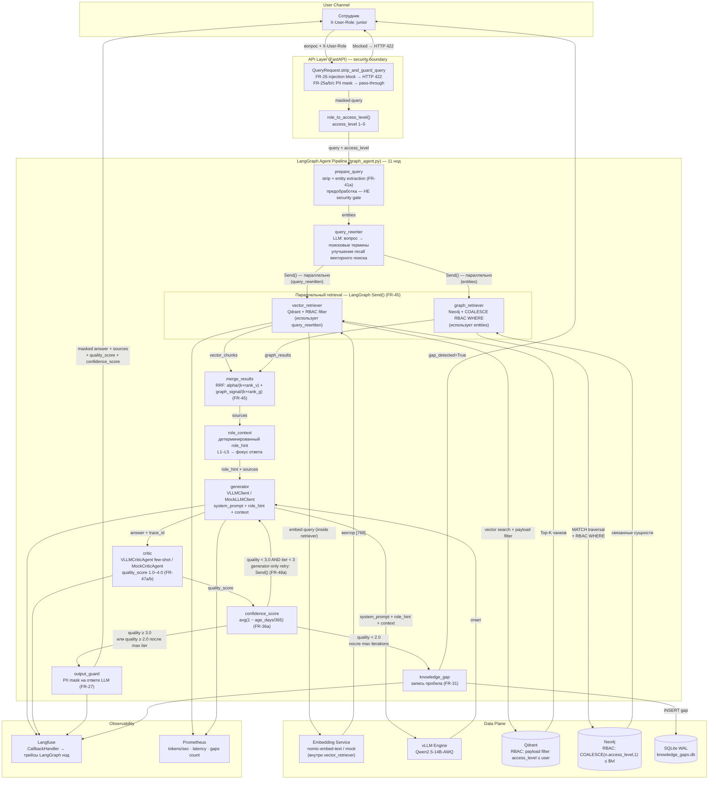

```mermaid
flowchart TD
    subgraph USER["User Channel"]
        U["Сотрудник\nX-User-Role: junior"]
    end

    subgraph API["API Layer (FastAPI) — security boundary"]
        VALIDATOR["QueryRequest.strip_and_guard_query\nFR-26 injection block → HTTP 422\nFR-25a/b/c PII mask → pass-through"]
        RBAC["role_to_access_level()\naccess_level 1–5"]
    end

    subgraph CP["LangGraph Agent Pipeline (graph_agent.py) — 11 нод"]
        PQ["prepare_query\nstrip + entity extraction (FR-41a)\nпредобработка — НЕ security gate"]
        QRW["query_rewriter\nLLM: вопрос → поисковые термины\nулучшение recall векторного поиска"]

        subgraph PARALLEL["Параллельный retrieval — LangGraph Send() (FR-45)"]
            VR["vector_retriever\nQdrant + RBAC filter\n(использует query_rewritten)"]
            GR["graph_retriever\nNeo4j + COALESCE RBAC WHERE\n(использует entities)"]
        end

        MR["merge_results\nRRF: alpha/(k+rank_v) + graph_signal/(k+rank_g) (FR-45)"]
        RC["role_context\nдетерминированный role_hint\nL1–L5 → фокус ответа"]
        GEN["generator\nVLLMClient / MockLLMClient\nsystem_prompt + role_hint + context"]
        CRIT["critic\nVLLMCriticAgent few-shot / MockCriticAgent\nquality_score 1.0–4.0 (FR-47a/b)"]
        CS["confidence_score\navg(1 − age_days/365) (FR-36a)"]
        OG["output_guard\nPII mask на ответе LLM (FR-27)"]
        KG["knowledge_gap\nзапись пробела (FR-31)"]
    end

    subgraph DP["Data Plane"]
        EMB["Embedding Service\nnomic-embed-text / mock\n(внутри vector_retriever)"]
        VLLM["vLLM Engine\nQwen2.5-14B-AWQ"]
        QD[("Qdrant\nRBAC: payload filter access_level ≤ user")]
        N4J[("Neo4j\nRBAC: COALESCE(n.access_level,1) ≤ $lvl")]
        SQLITE[("SQLite WAL\nknowledge_gaps.db")]
    end

    subgraph OBS["Observability"]
        LF["Langfuse\nCallbackHandler → трейсы LangGraph нод"]
        PROM["Prometheus\ntokens/sec · latency · gaps count"]
    end

    U -->|"вопрос + X-User-Role"| VALIDATOR
    VALIDATOR -->|"blocked → HTTP 422"| U
    VALIDATOR -->|"masked query"| RBAC
    RBAC -->|"query + access_level"| PQ

    PQ -->|"entities"| QRW
    QRW -->|"Send() — параллельно\n(query_rewritten)"| VR
    QRW -->|"Send() — параллельно\n(entities)"| GR

    VR -->|"embed query (inside retriever)"| EMB
    EMB -->|"вектор [768]"| VR
    VR -->|"vector search + payload filter"| QD
    QD -->|"Top-K чанков"| VR
    VR -->|"vector_chunks"| MR

    GR -->|"MATCH traversal\n+ RBAC WHERE"| N4J
    N4J -->|"связанные сущности"| GR
    GR -->|"graph_results"| MR

    MR -->|"sources"| RC
    RC -->|"role_hint + sources"| GEN
    GEN -->|"system_prompt + role_hint + context"| VLLM
    VLLM -->|"ответ"| GEN
    GEN -->|"answer + trace_id"| CRIT
    CRIT -->|"quality_score"| CS

    CS -->|"quality < 3.0 AND iter < 3\ngenerator-only retry: Send() (FR-48a)"| GEN
    CS -->|"quality < 2.0\nпосле max iterations"| KG
    CS -->|"quality ≥ 3.0\nили quality ≥ 2.0 после max iter"| OG

    KG -->|"INSERT gap"| SQLITE
    KG -->|"gap_detected=True"| U

    OG -->|"masked answer + sources\n+ quality_score + confidence_score"| U

    GEN --> LF
    CRIT --> LF
    OG --> LF
    KG --> LF
    VR --> PROM
    GEN --> PROM
```
