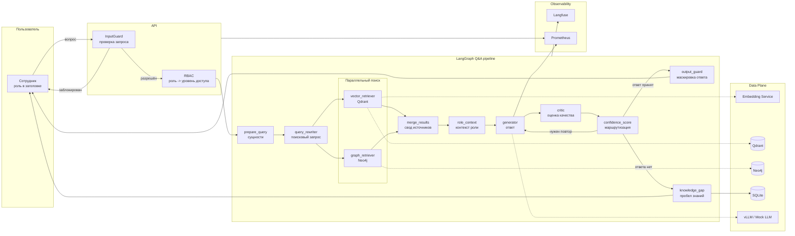

```mermaid
flowchart LR
    subgraph USER["Пользователь"]
        U["Сотрудник\nроль в заголовке"]
    end

    subgraph API["API"]
        GUARD["InputGuard\nпроверка запроса"]
        RBAC["RBAC\nроль -> уровень доступа"]
    end

    subgraph AGENT["LangGraph Q&A pipeline"]
        PREP["prepare_query\nсущности"]
        REWRITE["query_rewriter\nпоисковый запрос"]

        subgraph RETRIEVAL["Параллельный поиск"]
            VEC["vector_retriever\nQdrant"]
            GRAPH["graph_retriever\nNeo4j"]
        end

        MERGE["merge_results\nсвод источников"]
        ROLE["role_context\nконтекст роли"]
        GEN["generator\nответ"]
        CRITIC["critic\nоценка качества"]
        ROUTE["confidence_score\nмаршрутизация"]
        OUT["output_guard\nмаскировка ответа"]
        GAP["knowledge_gap\nпробел знаний"]
    end

    subgraph DATA["Data Plane"]
        EMB["Embedding Service"]
        QD[("Qdrant")]
        N4J[("Neo4j")]
        SQLITE[("SQLite")]
        LLM["vLLM / Mock LLM"]
    end

    subgraph OBS["Observability"]
        LF["Langfuse"]
        PROM["Prometheus"]
    end

    U -->|"вопрос"| GUARD
    GUARD -->|"разрешён"| RBAC
    GUARD -->|"заблокирован"| U
    RBAC --> PREP

    PREP --> REWRITE
    REWRITE --> VEC
    REWRITE --> GRAPH
    VEC --> MERGE
    GRAPH --> MERGE
    MERGE --> ROLE
    ROLE --> GEN
    GEN --> CRITIC
    CRITIC --> ROUTE

    ROUTE -->|"ответ принят"| OUT
    ROUTE -->|"нужен повтор"| GEN
    ROUTE -->|"ответа нет"| GAP

    GAP --> SQLITE
    GAP --> U
    OUT --> U

    VEC -.-> EMB
    VEC -.-> QD
    GRAPH -.-> N4J
    GEN -.-> LLM

    AGENT --> LF
    API --> PROM
    GEN --> PROM
```
