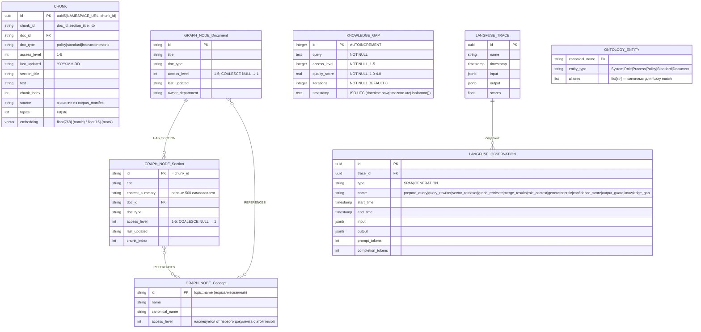

```mermaid
erDiagram

    %% ─── QDRANT ───────────────────────────────────────────────────────────────
    %% Единственная коллекция: "chunks" (отдельной коллекции documents нет)

    CHUNK {
        uuid        id              PK   "uuid5(NAMESPACE_URL, chunk_id)"
        string      chunk_id             "doc_id::section_title::idx"
        string      doc_id          FK
        string      doc_type             "policy|standard|instruction|matrix"
        int         access_level         "1-5"
        string      last_updated         "YYYY-MM-DD"
        string      section_title
        string      text
        int         chunk_index
        string      source               "значение из corpus_manifest"
        list        topics               "list[str]"
        vector      embedding            "float[768] (nomic) / float[16] (mock)"
    }

    %% ─── NEO4J ────────────────────────────────────────────────────────────────
    %% Реальные label'ы: Document, Section, Concept
    %% Реальные rel types: HAS_SECTION, REFERENCES
    %% (_ALLOWED_LABELS / _ALLOWED_REL_TYPES в graph_repository.py)

    GRAPH_NODE_Document {
        string      id              PK
        string      title
        string      doc_type
        int         access_level         "1-5; COALESCE NULL → 1"
        string      last_updated
        string      owner_department
    }

    GRAPH_NODE_Section {
        string      id              PK   "= chunk_id"
        string      title
        string      content_summary      "первые 500 символов text"
        string      doc_id          FK
        string      doc_type
        int         access_level         "1-5; COALESCE NULL → 1"
        string      last_updated
        int         chunk_index
    }

    GRAPH_NODE_Concept {
        string      id              PK   "topic::name (нормализованный)"
        string      name
        string      canonical_name
        int         access_level         "наследуется от первого документа с этой темой"
    }

    GRAPH_NODE_Document ||--o{ GRAPH_NODE_Section : "HAS_SECTION"
    GRAPH_NODE_Document }o--o{ GRAPH_NODE_Concept : "REFERENCES"
    GRAPH_NODE_Section  }o--o{ GRAPH_NODE_Concept : "REFERENCES"

    %% ─── SQLITE ───────────────────────────────────────────────────────────────
    %% gap_store.py — WAL mode, один persistent connection per process
    %% Spec FR-32a/b: PostgreSQL в production; SQLite — local-lite fallback

    KNOWLEDGE_GAP {
        integer     id              PK   "AUTOINCREMENT"
        text        query                "NOT NULL"
        integer     access_level         "NOT NULL, 1-5"
        real        quality_score        "NOT NULL, 1.0-4.0"
        integer     iterations           "NOT NULL DEFAULT 0"
        text        timestamp            "ISO UTC (datetime.now(timezone.utc).isoformat())"
    }

    %% ─── LANGFUSE (internal) ──────────────────────────────────────────────────
    %% Таблицы ниже управляются Langfuse автоматически (langfuse/langfuse:2).
    %% Код приложения не создаёт и не читает их напрямую — только пишет
    %% через langfuse.callback.CallbackHandler.
    %% PostgreSQL: synapse-postgres (docker-compose profile=observability).

    LANGFUSE_TRACE {
        uuid        id              PK
        string      name
        timestamp   timestamp
        jsonb       input
        jsonb       output
        float       scores
    }

    LANGFUSE_OBSERVATION {
        uuid        id              PK
        uuid        trace_id        FK
        string      type                 "SPAN|GENERATION"
        string      name                 "prepare_query|query_rewriter|vector_retriever|graph_retriever|merge_results|role_context|generator|critic|confidence_score|output_guard|knowledge_gap"
        timestamp   start_time
        timestamp   end_time
        jsonb       input
        jsonb       output
        int         prompt_tokens
        int         completion_tokens
    }

    LANGFUSE_TRACE ||--o{ LANGFUSE_OBSERVATION : "содержит"

    %% ─── ONTOLOGY (in-memory, читается из docs/ontology.json) ────────────────
    ONTOLOGY_ENTITY {
        string      canonical_name  PK
        string      entity_type          "System|Role|Process|Policy|Standard|Document"
        list        aliases              "list[str] — синонимы для fuzzy match"
    }
```
