# ER-диаграмма — Synapse GraphRAG Data Model

## Назначение

Диаграмма описывает структуры данных всех хранилищ Synapse и логические связи между ними. Используется как справочник при разработке и для объяснения архитектуры на защите.

## Хранилища

| Хранилище | Технология | Что хранит |
|-----------|-----------|------------|
| **Qdrant** | Векторная БД | Чанки документов с эмбеддингами и RBAC-метаданными |
| **Neo4j** | Графовая БД | Узлы Document / Section / Concept и рёбра между ними |
| **SQLite** (knowledge_gaps.db) | Реляционная БД | Запросы без ответа (Knowledge Gap Detection) |
| **SQLite** (audit.db) | Реляционная БД | Лог каждого `/query` запроса (ФЗ-152) |
| **Langfuse Cloud** | Внешний сервис | OTel-трейсы нод агента — хранится удалённо, не локально |

Synapse использует **полиглот-персистентность** — пять разных хранилищ с разными моделями данных. Внешние ключи работают только внутри одной СУБД. Связи между хранилищами — **логические**, а не реляционные:

- **`CHUNK.chunk_id` = `GRAPH_NODE_Section.id`** — один и тот же идентификатор чанка используется и в Qdrant, и в Neo4j. Это намеренный дизайн: при merge-результатов поиска агент объединяет записи по `chunk_id` без JOIN-запроса.
- **`CHUNK.doc_id` → `GRAPH_NODE_Document.id`** — `doc_id` есть в обоих хранилищах, но нет FK-ограничения. Консистентность обеспечивается ingestion pipeline: документ и его чанки записываются в одной транзакции.
- **`KNOWLEDGE_GAP`, `AUDIT_LOG`** не связаны с Qdrant/Neo4j — они хранят производные данные (хеш запроса, access_level) без ссылки на конкретный документ. Это намеренно: gap может возникнуть при отсутствии документов, а audit-запись нужна независимо от результата поиска.
- **`LANGFUSE_*`** — внешняя схема (Langfuse Cloud). Связь с остальными данными только через `trace_id`, который API возвращает в `QueryResponse.trace_id`. Локально не хранится.

```mermaid
erDiagram

    %% ── Qdrant (векторное хранилище) ────────────────────────────────────────
    %%    Каждая точка = один чанк документа.
    %%    id = uuid5(NAMESPACE_URL, chunk_id) — детерминированный UUID.

    CHUNK {
        uuid        id              PK  "uuid5 от chunk_id"
        string      chunk_id            "doc_id + '_' + chunk_index"
        string      doc_id          FK  "→ DOCUMENT.id"
        string      doc_type            "document | policy | standard | ..."
        int         access_level        "1–5 (RBAC payload filter)"
        string      last_updated        "ISO date — для confidence_score"
        string      section_title       "заголовок раздела Markdown"
        string      text                "текст чанка"
        int         chunk_index         "порядковый номер в документе"
        string      source              "путь к исходному файлу"
        list        topics              "список концептов из онтологии"
        vector      embedding           "768-dim (nomic-embed-text / mock)"
    }

    %% ── Neo4j (граф знаний) ──────────────────────────────────────────────────
    %%    Узлы Document и Section создаются при ingestion через UNWIND batch.
    %%    chunk_id в GRAPH_NODE_Section = id в CHUNK (cross-store link).

    GRAPH_NODE_Document {
        string      id              PK  "doc_id из corpus_manifest"
        string      title               "название документа"
        string      doc_type            "тип документа"
        int         access_level        "1–5 (Neo4j WHERE RBAC)"
        string      last_updated        "ISO date"
        string      owner_department    "владелец / отдел"
    }

    GRAPH_NODE_Section {
        string      id              PK  "chunk_id (= CHUNK.chunk_id)"
        string      title               "section_title чанка"
        string      content_summary     "text[:500] — краткое содержание"
        string      doc_id          FK  "→ GRAPH_NODE_Document.id"
        string      doc_type
        int         access_level        "1–5"
        string      last_updated
        int         chunk_index
    }

    GRAPH_NODE_Concept {
        string      id              PK  "canonical_name.lower().replace(' ', '_')"
        string      name                "оригинальный термин"
        string      canonical_name      "нормализованное имя"
        int         access_level        "наследуется от документа"
    }

    GRAPH_NODE_Document ||--o{ GRAPH_NODE_Section  : "HAS_SECTION"
    GRAPH_NODE_Document }o--o{ GRAPH_NODE_Concept  : "REFERENCES"
    GRAPH_NODE_Section  }o--o{ GRAPH_NODE_Concept  : "REFERENCES"

    %% Cross-store: CHUNK.chunk_id = GRAPH_NODE_Section.id
    CHUNK }o--|| GRAPH_NODE_Section : "chunk_id (logical link)"

    %% ── SQLite WAL: knowledge_gaps.db ────────────────────────────────────────
    %%    Записывается нодой knowledge_gap когда quality_score < 2.0
    %%    после max_iterations retry.

    KNOWLEDGE_GAP {
        integer     id              PK
        text        query               "оригинальный текст запроса"
        integer     access_level        "уровень пользователя"
        real        quality_score       "оценка CriticAgent (< 2.0)"
        integer     iterations          "число итераций retry (default 0)"
        text        timestamp           "ISO UTC datetime"
    }

    %% ── SQLite WAL: audit.db ─────────────────────────────────────────────────
    %%    Записывается при каждом /query запросе (ФЗ-152 / FR-security).
    %%    query_hash = SHA-256 от текста запроса (plain text не хранится).

    AUDIT_LOG {
        integer     id              PK
        text        user_role           "junior | middle | senior | manager | admin"
        integer     access_level        "1–5"
        text        query_hash          "SHA-256 hex запроса"
        integer     result_count        "число возвращённых источников"
        real        quality_score       "оценка CriticAgent (1.0–4.0)"
        integer     gap_detected        "0 | 1"
        text        timestamp           "ISO UTC datetime"
    }

    %% ── Langfuse Cloud (внешний сервис) ──────────────────────────────────────
    %%    Не хранится локально — трейсы отправляются через OTel OTLP.
    %%    Схема приведена справочно (реальная схема Langfuse Cloud).

    LANGFUSE_TRACE {
        uuid        id              PK
        string      name                "POST /query"
        timestamp   timestamp
        jsonb       input               "запрос пользователя"
        jsonb       output              "QueryResponse"
        float       scores              "quality_score от critic"
    }

    LANGFUSE_OBSERVATION {
        uuid        id              PK
        uuid        trace_id        FK
        string      type                "SPAN"
        string      name                "prepare_query | vector_retriever | ..."
        timestamp   start_time
        timestamp   end_time
        jsonb       input
        jsonb       output
        int         prompt_tokens
        int         completion_tokens
    }

    LANGFUSE_TRACE ||--o{ LANGFUSE_OBSERVATION : "contains"
```

