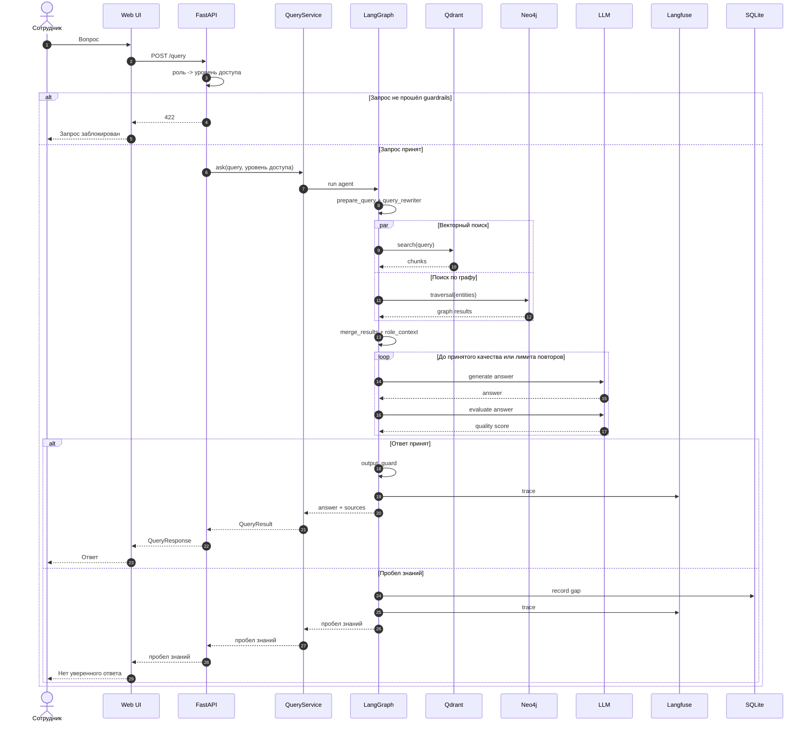

```mermaid
sequenceDiagram
    autonumber

    actor User as Сотрудник
    participant UI as Web UI
    participant API as FastAPI
    participant QS as QueryService
    participant LG as LangGraph
    participant QD as Qdrant
    participant N4J as Neo4j
    participant LLM as LLM
    participant LF as Langfuse
    participant DB as SQLite

    User->>UI: Вопрос
    UI->>API: POST /query
    API->>API: роль -> уровень доступа

    alt Запрос не прошёл guardrails
        API-->>UI: 422
        UI-->>User: Запрос заблокирован
    else Запрос принят
        API->>QS: ask(query, уровень доступа)
        QS->>LG: run agent

        LG->>LG: prepare_query + query_rewriter

        par Векторный поиск
            LG->>QD: search(query)
            QD-->>LG: chunks
        and Поиск по графу
            LG->>N4J: traversal(entities)
            N4J-->>LG: graph results
        end

        LG->>LG: merge_results + role_context

        loop До принятого качества или лимита повторов
            LG->>LLM: generate answer
            LLM-->>LG: answer
            LG->>LLM: evaluate answer
            LLM-->>LG: quality score
        end

        alt Ответ принят
            LG->>LG: output_guard
            LG->>LF: trace
            LG-->>QS: answer + sources
            QS-->>API: QueryResult
            API-->>UI: QueryResponse
            UI-->>User: Ответ
        else Пробел знаний
            LG->>DB: record gap
            LG->>LF: trace
            LG-->>QS: пробел знаний
            QS-->>API: пробел знаний
            API-->>UI: пробел знаний
            UI-->>User: Нет уверенного ответа
        end
    end
```
